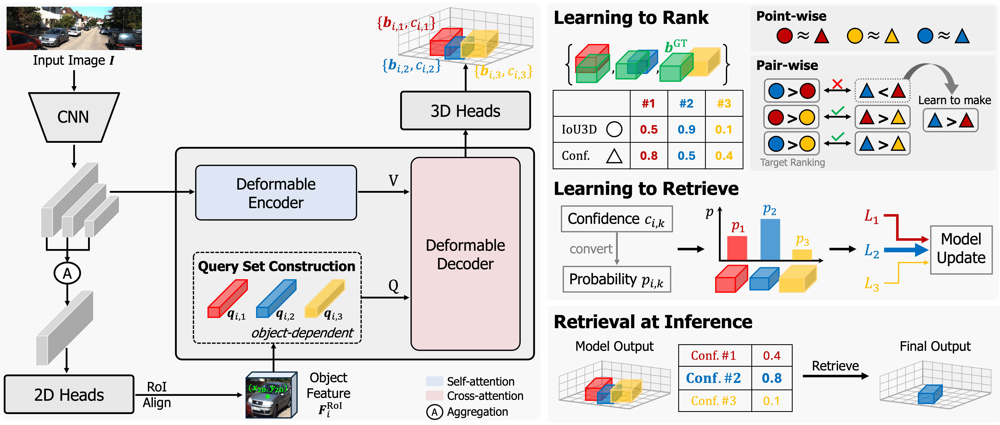

# RARE: Learn to RAnk and REtrieve for Monocular 3D Object Detection (CVPR 2026)

<!--

-->

The official implementation of the paper, **RARE: Learn to RAnk and REtrieve for Monocular 3D Object Detection**. RARE rethinks confidence learning in monocular 3D detection by casting it as a ranking problem rather than score regression.
By aligning predictions with relative geometric quality, we obtain more stable and reliable confidence estimates.
We further model multimodal 3D ambiguity through diverse hypothesis generation and retrieval.

  

---

## Updates
- **[2026-05-28]** Initial code release.
---

### Note on setup
Environment and dataset preparation in this repo follow the similar conventions as MonoLSS and MonoDETR. Please refer to the [MonoLSS repository](https://github.com/Traffic-X/MonoLSS) and [MonoDETR repository](https://github.com/ZrrSkywalker/MonoDETR) for detailed instructions. We thank the all the authors for releasing their pipeline and documentation.
